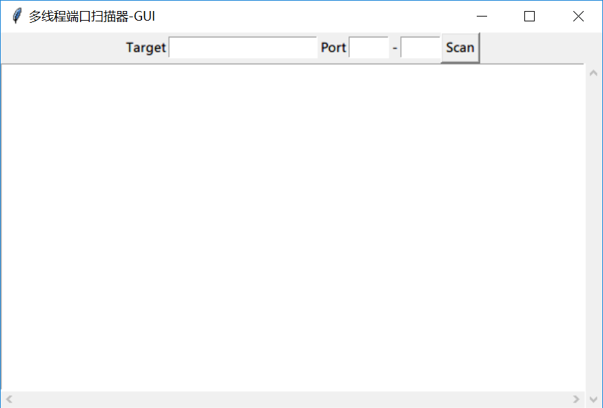

# 多线程端口扫描器

非常简单多线程批量端口扫描器，含图形界面（Python3编写）

## 依赖库

`pip install prettytable`

## 使用

`python PostSacn.py`

Target中可填单IP地址、CIDR格式IP地址段、域名

如 192.168.1.1、111.111.111.0/24、baidu.com

## 说明

nmap-services是nmap的服务信息文件，来自https://svn.nmap.org/nmap/nmap-services
